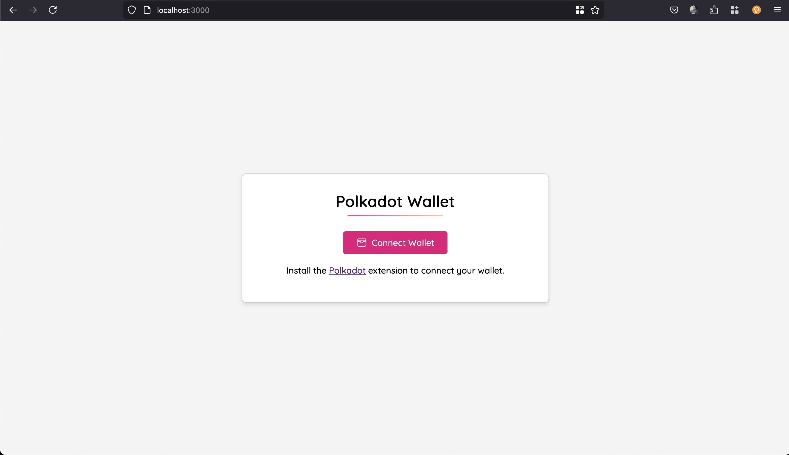
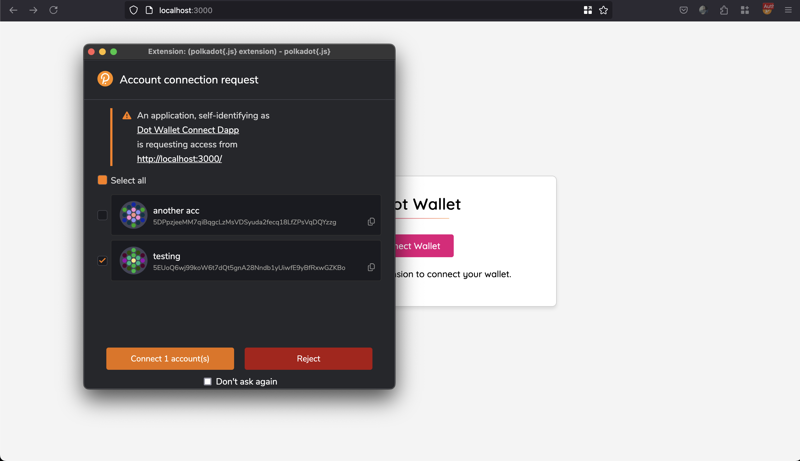
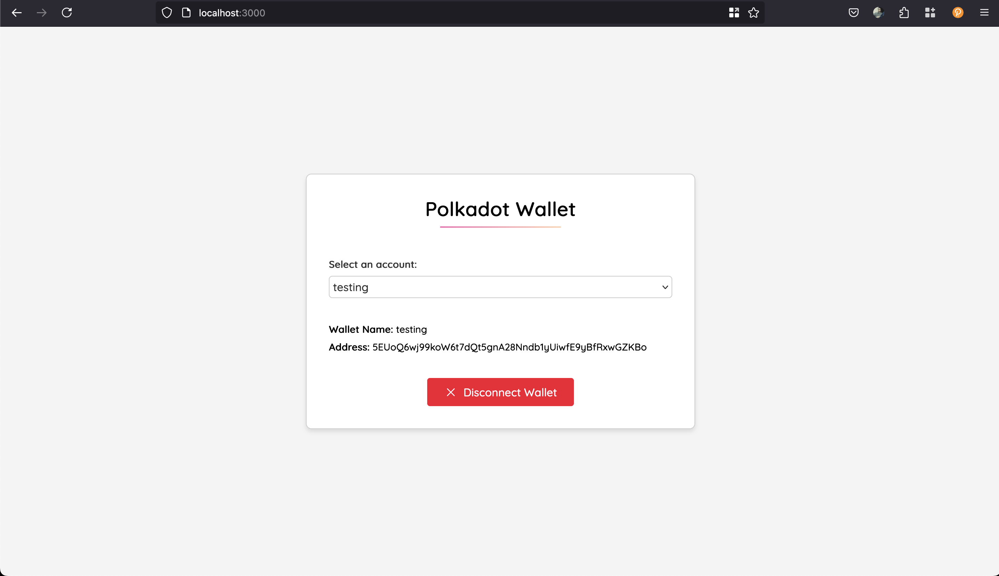

# Polkadot Wallet Connect App

This is a **Polkadot Wallet Connect** app built with **React 19**, **Vite**, and **pnpm**. It allows users to connect their **Polkadot.js** wallet, fetch accounts, detect account changes, handle errors elegantly, and persist the selected account across page refreshes using **localStorage**.

## 🚀 Features

✅ Connects to **Polkadot.js Wallet** via `@polkadot/extension-dapp`\
✅ Fetches available accounts and allows switching between them\
✅ Detects real-time account changes in the extension\
✅ Retrieves the **injector** for the selected account\
✅ **Persists** the selected account across refreshes using `localStorage`\
✅ Handles errors gracefully and provides user-friendly messages

### 🔮 Future Enhancements

- Fetch and display **account balances**
- Support for **multiple Polkadot wallet extensions**
- Transaction signing functionality
- Improved UI with enhanced account details

## 🛠️ Tech Stack

- **Vite** - Fast development bundler
- **React 19** - Modern frontend framework
- **pnpm** - Fast, disk-efficient package manager
- **@polkadot/api** (`^15.6.1`) - Polkadot API integration
- **@polkadot/extension-dapp** (`^0.58.4`) - Wallet connection library

## 📸 Screenshots

### Connect Page



### Connect Approval



### Wallet Info



### No Accounts Connected


## 🚀 Getting Started

### 1️⃣ Install Dependencies

```sh
pnpm install
```

### 2️⃣ Start the Development Server

```sh
pnpm dev
```

### 3️⃣ Build for Production

```sh
pnpm build
```

### 4️⃣ Preview Production Build

```sh
pnpm preview
```

## 🔗 Connecting to the Wallet

1. Install the [Polkadot.js Extension](https://polkadot.js.org/extension/).
2. Open the app and click **Connect Wallet**.
3. Select an account and approve the connection.
4. The selected account will persist even after a refresh.

## 🛠️ Configuration

- The app **automatically detects changes** in the wallet (e.g., when accounts are added or removed).
- Selected account is stored in **localStorage** to persist across sessions.
